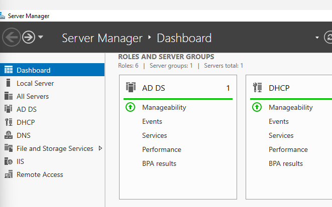
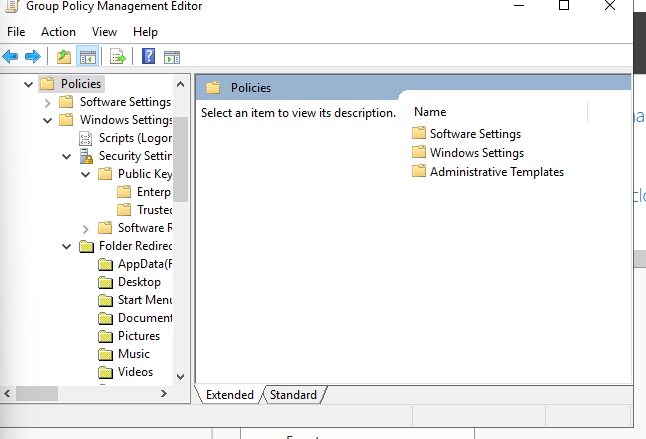
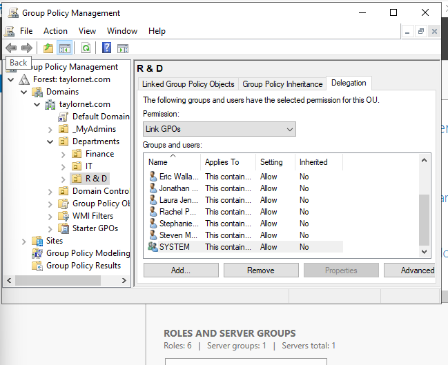

# PROJECTNAME

## Objective
[Brief Objective - Remove this afterwards]

The Detection Lab project aimed to establish a controlled environment for simulating and detecting cyber attacks. The primary focus was to ingest and analyze logs within a Security Information and Event Management (SIEM) system, generating test telemetry to mimic real-world attack scenarios. This hands-on experience was designed to deepen understanding of network security, attack patterns, and defensive strategies.

### Skills Learned
[Bullet Points - Remove this afterwards]

- Advanced understanding of SIEM concepts and practical application.
- Proficiency in analyzing and interpreting network logs.
- Ability to generate and recognize attack signatures and patterns.
- Enhanced knowledge of network protocols and security vulnerabilities.
- Development of critical thinking and problem-solving skills in cybersecurity.

### Tools Used
[Bullet Points - Remove this afterwards]

- Security Information and Event Management (SIEM) system for log ingestion and analysis.
- Network analysis tools (such as Wireshark) for capturing and examining network traffic.
- Telemetry generation tools to create realistic network traffic and attack scenarios.

## Steps
 

I installed Windows Server 2019 into a VM with VMWare and started a new domain under taylornet.com. I set up a DHCP server with a rather small scope because I have no other device to connect to.  I also am using two NIC on the Domain Controller and configured it so that access to the public internet is done through the Controller (AKA the domain controller serves as the gateway router) 

  

Next, I created three OUs for the three departments I will have in this company:  Finance, IT, and R & D.  I am using the GPO editor to create group policies within these departments.   As I will only have one extra device connected to this domain, I decided that modifying the user settings in the GPO policy editor would be ideal in this situation. 

I created some users and assigned them to one of the groups of policies specific to each department in the company.  The departments each have their own policies specific to the needs of what their roles require. 

 
